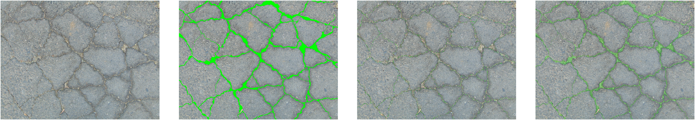
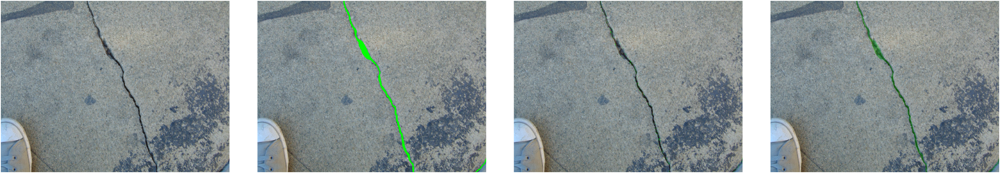

# Introduction
 

Binary image segmentation is one of the most widely application in machine learning or deep learning. For example segmenting the cracks from the complex background image. Typically in the supervised paradigm annotation of images are required. A human annotations can be erroreneous and requires a careful quality control and assessment of the same. In this repository, a simple MATLAB script helps to assess and control the quality of binary images segmentation annotations using various image overlay techniques and visualizations.

# Sample outputs:
| Images |
| ------ |
| Complex visualization of image pairs | 
|  |
| A focused visualization of image pairs | 
|  |
| Complex visualization of image pairs | 
|  |
| A focused visualization of image pairs | 
|  |

# Requirements
MATLAB  
Image Processing Toolbox

# Feedback
Please rate and provide feedback for the further improvements.
